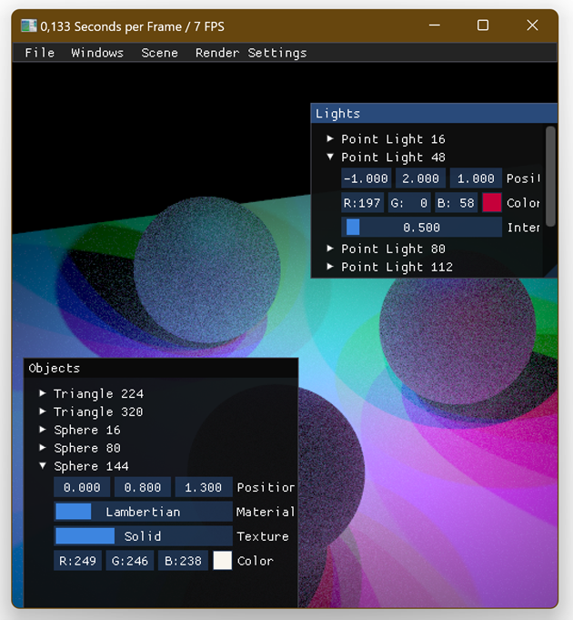
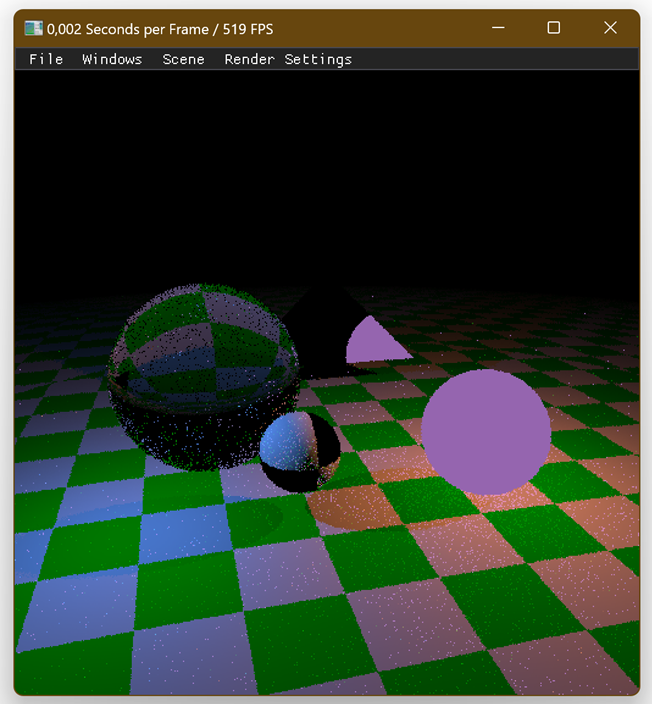
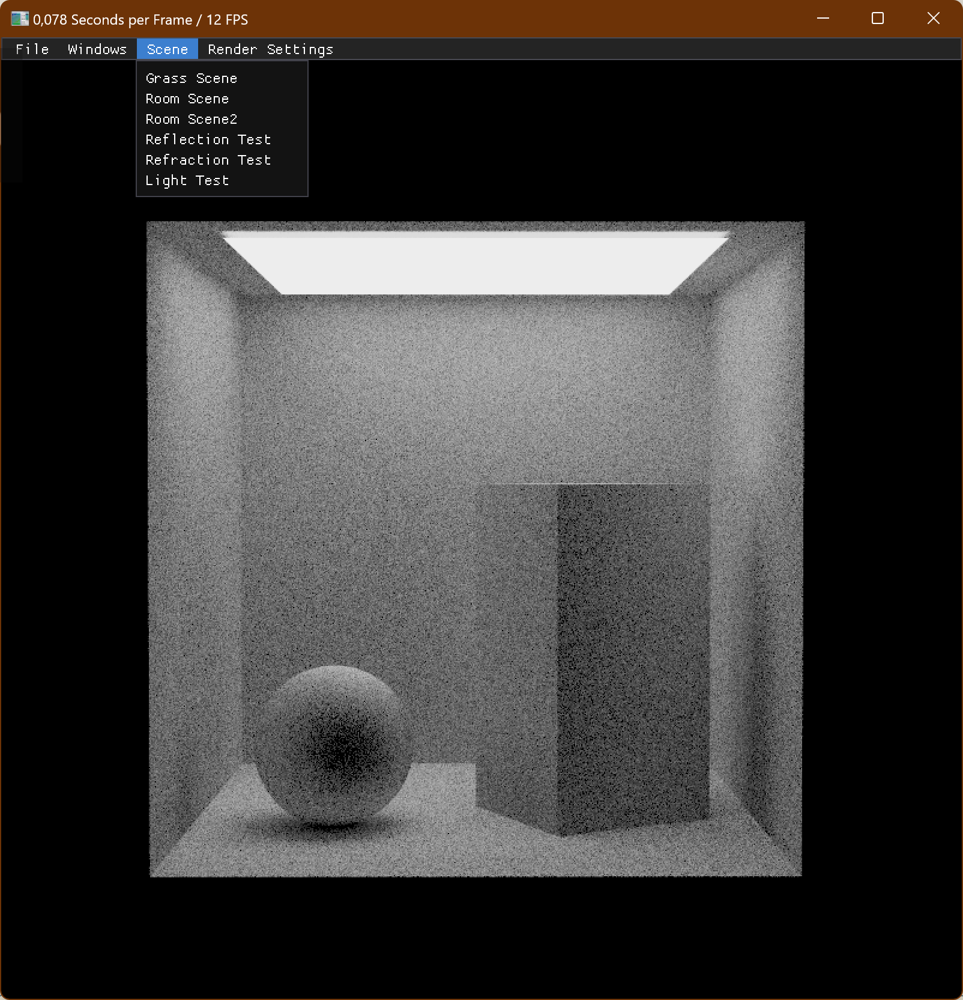

## Description

.bmp)  

**Dull** - a simple desktop *path-tracer* program that was written using the graphical library [OpenTK](https://opentk.net) and offers scene viewing and editing with the ability to load 3d models from ".obj" files.  

Editing includes changing the parameters (size, rotation and position along the axis) of objects and lights in the scene, changing the render parameters of the virtual camera, and also manipulating path-tracing values that affect the quality of the image in terms of the noise of the output image and rendering performance in terms of FPS.

It uses OpenGL as a base with the majority of the tracing algorithms written using compute shaders. All UI and user input handling code was written in C# with the help of a wonderful wrapper [ImGui.Net](https://github.com/ImGuiNET/ImGui.NET) of the equally wonderful library called "Dear ImGui".

## Controls

- ***WASD*** - Move
- ***Tab*** - On/Off  screen cursor
- ***Left Shift*** - Speed up camera
- ***Left Ctrl*** - Lower camera
- ***Space*** - Raise camera
- ***C*** - Zoom
- ***P*** - Depth view mode
- ***N*** - Normals view mode
- ***F*** - Render view mode
- ***Esc*** - close program
  
## Screenshots

.bmp)

.bmp)

.bmp)

.bmp)